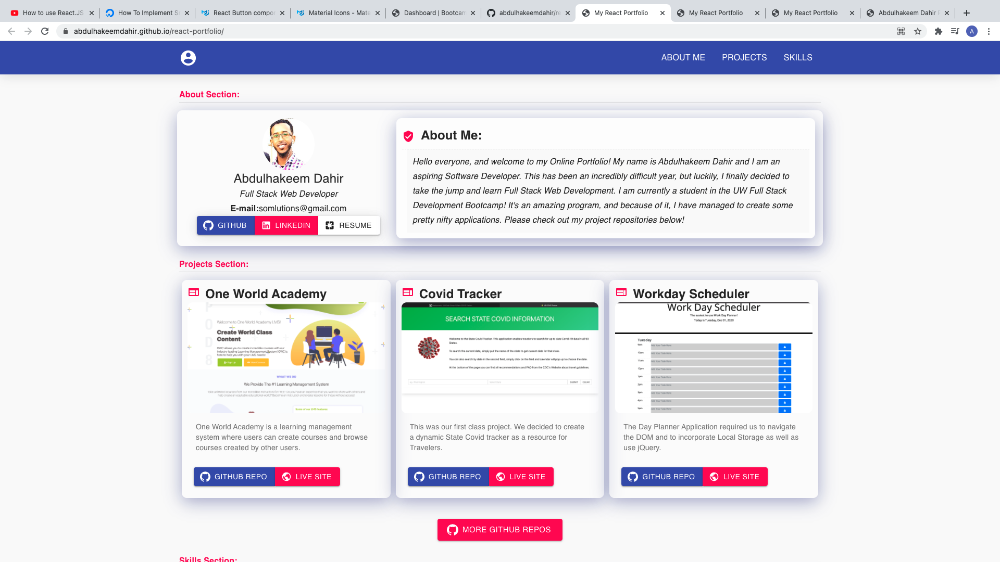

# react-portfolio

Personal Portfolio

## Table of Contents

- [Developer Comment](#developer-comment)
- [Application Summary](#application-summary)
- [User Story](#user-story)
- [Acceptance Criteria](#acceptance-criteria)
- [Live Project Site](#live-project-site)
- [Installation and Git Repository](#installation-and-git-repository)
- [Credits](#credits)

## Developer Comment

Hello everyone, and welcome back to my Repo! My name is Abdulhakeem Dahir and I am an aspiring Software Developer. This week I have been tasked to update my Online Portfolio. I'm excited as I incorporated both React and Material UI! Any feedback is welcome! Thank you!

## Application Summary

An Employer is looking to hire a Web Developer for a Full Time or Part Time role. They are seeking someone who can showcase their talent and skillset by having a Live and Deployed Portfolio. The Portfolio itself must be responsive, and it must showcase all of the work that the applicant has done.

### User Story

```
AS AN employer
I WANT to view a potential employee's deployed portfolio of work samples
SO THAT I can review samples of their work and assess whether they're a good candidate for an open position
```

### Acceptance Criteria

```
- Submit an updated portfolio featuring Project 1 and two exemplary homework assignments.
- Submit an updated GitHub profile with pinned repositories featuring Project 1 and two exemplary assignments.
- Submit an updated resume
- Submit an updated LinkedIn profile
```

## Live Project Site

https://abdulhakeemdahir.github.io/react-portfolio/



## Installation and Git Repository

Respository: https://github.com/abdulhakeemdahir/react-portfolio

Please follow the installation process below:

```
1. Fork the repository from the link above
2. Clone the repo to your computer via git
3. Open the project files with the text editor of your choice.
```

## Credits

Iconfinder for all of the Free Images that I used!
